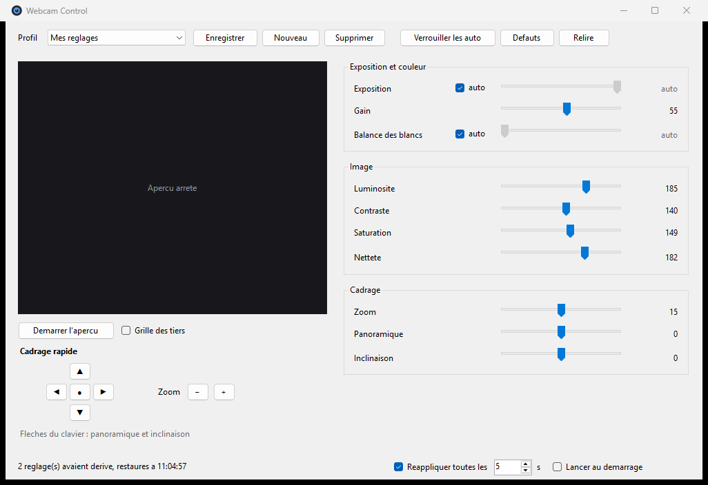

# Webcam Control

Panneau de contrôle alternatif pour webcam UVC sous Windows, écrit parce que les
utilitaires constructeurs sont pénibles et que les réglages ne tiennent pas.

Développé et validé sur une **NexiGo N60 FHD**, mais rien n'est spécifique à ce
modèle : l'application interroge la caméra au démarrage et n'affiche que les
réglages qu'elle expose réellement, avec ses bornes réelles.



## Pourquoi pas un « vrai » driver

La NexiGo N60 n'a pas de pilote constructeur : Windows la gère avec son pilote de
classe UVC générique, `usbvideo.sys`, à jour et parfaitement fonctionnel.

```
FriendlyName : NexiGo N60 FHD Webcam
InstanceId   : USB\VID_3443&PID_60BB&MI_00
Service      : usbvideo
Mfg          : @usbvideo.inf,%msft%;Microsoft
```

Écrire un pilote noyau de remplacement n'apporterait donc rien, coûterait une
signature WHQL et ferait perdre la compatibilité. Tout le contrôle utile d'une
caméra UVC passe par l'espace utilisateur, via les interfaces DirectShow
`IAMVideoProcAmp` et `IAMCameraControl`. C'est ce que fait cette application.

## Ce que la caméra expose

Relevé fait par l'application elle-même sur la N60 :

| Réglage | Interface | Plage | Défaut | Auto |
|---|---|---|---|---|
| Exposition | CameraControl | −14 … −1 (2^n secondes) | −7 | oui |
| Gain | VideoProcAmp | 0 … 100 | 5 | non |
| Balance des blancs | VideoProcAmp | 2600 … 6500 K | 4650 | oui |
| Luminosité | VideoProcAmp | 0 … 255 | 128 | non |
| Contraste | VideoProcAmp | 0 … 255 | 128 | non |
| Saturation | VideoProcAmp | 0 … 255 | 128 | non |
| Netteté | VideoProcAmp | 0 … 255 | 128 | non |
| Zoom | CameraControl | 10 … 20 | 10 | non |
| Panoramique | CameraControl | −10 … +10 | 0 | non |
| Inclinaison | CameraControl | −10 … +10 | 0 | non |

Pas de mise au point pilotable (objectif à focale fixe), pas de teinte, pas de
gamma, pas de compensation de contre-jour : ces propriétés ne sont pas
implémentées par le firmware et l'application ne les affiche donc pas.

Formats de capture disponibles : MJPEG jusqu'à 1920x1080 à 30 i/s,
YUY2 limité à 1280x720 à 10 i/s.

## Fonctionnalités

- **Tous les réglages UVC en curseurs**, découverts dynamiquement.
- **Profils nommés** enregistrés en JSON, commutables depuis la fenêtre ou
  directement depuis la zone de notification.
- **Verrouiller les auto** : fige d'un clic l'exposition et la balance des blancs
  sur la valeur où l'automatique les a amenées. C'est le remède à l'image qui
  pompe et aux couleurs qui virent.
- **Watchdog** : toutes les N secondes, l'application relit la caméra et
  réapplique ce qui a dérivé. Les réglages ne se perdent plus quand une
  application les écrase ou quand la caméra sort de veille.
- **Reprise après rebranchement** : `WM_DEVICECHANGE` déclenche une reconnexion
  et une réapplication du profil.
- **Aperçu live** avec grille des tiers et pavé de cadrage panoramique / inclinaison / zoom.
- **Démarrage automatique** en zone de notification.
- **Mode ligne de commande** pour scripter l'application d'un profil.

## Compilation

Aucune dépendance, aucun SDK à installer : on utilise le compilateur C# livré
avec le .NET Framework, présent sur toute installation de Windows.

```powershell
.\build.ps1          # produit bin\WebcamControl.exe
.\build.ps1 -Run     # compile puis lance
```

## Utilisation

```
WebcamControl.exe                    ouvre le panneau
WebcamControl.exe --tray             démarre réduit dans la zone de notification
WebcamControl.exe --list             liste les caméras et les profils
WebcamControl.exe --apply "Visio"    applique un profil puis rend la main
```

Fermer la fenêtre réduit l'application dans la zone de notification ; le
watchdog continue de tourner. « Quitter » depuis le menu de l'icône arrête tout.

La configuration est dans `%APPDATA%\WebcamControl\config.json`, le journal dans
`%APPDATA%\WebcamControl\webcam-control.log`. Les deux sont lisibles et
modifiables à la main.

## La vraie cause des réglages perdus

Le watchdog traite le symptôme. La cause la plus fréquente est la **suspension
sélective USB** : Windows endort la caméra, qui repart aux valeurs d'usine au
réveil. Pour la désactiver (session administrateur nécessaire) :

```powershell
.\tools\fix-usb-suspend.ps1           # affiche l'état
.\tools\fix-usb-suspend.ps1 -Apply    # désactive la mise en veille
.\tools\fix-usb-suspend.ps1 -Revert   # remet l'état d'origine
```

Le script agit sur deux leviers : le paramètre de suspension sélective du plan
d'alimentation actif, et l'autorisation d'extinction du concentrateur USB qui
porte la caméra.

## Notes techniques

- **Pas d'accès exclusif.** Lier le filtre DirectShow de la caméra n'empêche pas
  une autre application de l'ouvrir, et réciproquement : mesuré dans les deux
  sens avec ffmpeg en train de capturer. Les réglages restent donc modifiables
  en pleine visioconférence.
- **Session persistante.** Un cycle complet « lier, lire, écrire, libérer » coûte
  21 ms. L'application garde le filtre lié pour la durée de vie du processus,
  ce qui ramène chaque écriture à environ 1 ms et permet un curseur fluide.
- **Aperçu sans graphe de rendu.** Plutôt que de monter un graphe DirectShow avec
  `IVideoWindow` — beaucoup d'interop fragile sur des interfaces duales —
  l'aperçu demande à ffmpeg de recopier telles quelles les trames MJPEG de la
  caméra (`-c:v copy`, donc aucun réencodage) et découpe le flux sur les
  marqueurs JPEG. ffmpeg doit être dans le `PATH`, sinon le chemin est
  configurable via `FfmpegPath` dans `config.json`.
- **Comparaison en mode auto.** Quand un réglage est en automatique, sa valeur lue
  dérive en permanence ; le watchdog ne compare alors que le mode, jamais la
  valeur, sinon il réécrirait sans arrêt.

## Limites connues

- L'aperçu peut échouer avec `Could not run graph` si une autre application tient
  déjà la caméra dans un format incompatible. Le pilotage des réglages, lui,
  continue de fonctionner. Fermer l'aperçu suffit.
- Le zoom, le panoramique et l'inclinaison de la N60 sont numériques : ils
  recadrent dans le capteur et coûtent donc de la définition.
